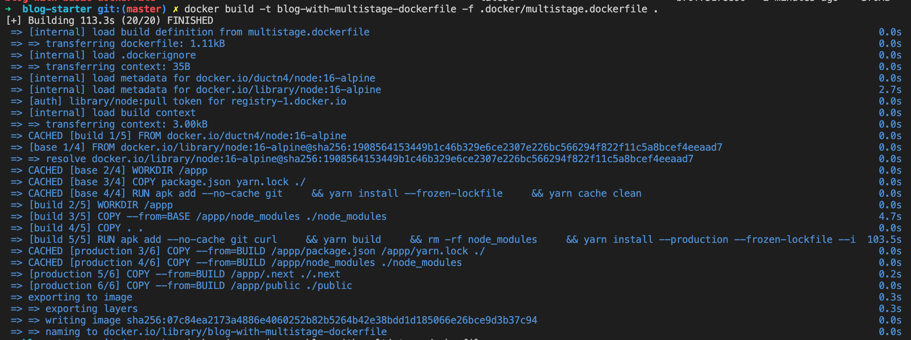
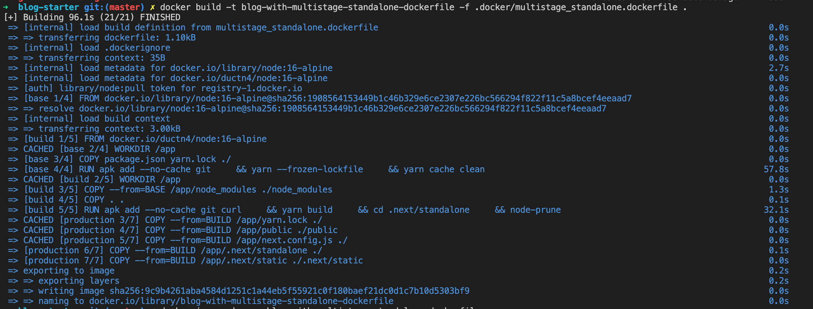

# Optimize Dockerfile images for NextJS


NextJS Docker images is too big. So, this article will focus on the way optimize
dockerfile for production. Here, i will use 2 ways for optimize docker images.

## Setup

First, we need to create a project with **nextjs**. Quickly, i use an example of
[Vercel](https://vercel.com/), project in [here](https://github.com/vercel/next.js/tree/canary/examples/blog-starter).

Project structure:

```sh
.
├── @types
│   └── remark-html.d.ts
├── README.md
├── _posts
│   ├── dynamic-routing.md
│   ├── hello-world.md
│   └── preview.md
├── components
│   ├── alert.tsx
│   ├── avatar.tsx
│   ├── container.tsx
│   ├── cover-image.tsx
│   ├── date-formatter.tsx
│   ├── footer.tsx
│   ├── header.tsx
│   ├── hero-post.tsx
│   ├── intro.tsx
│   ├── layout.tsx
│   ├── markdown-styles.module.css
│   ├── meta.tsx
│   ├── more-stories.tsx
│   ├── post-body.tsx
│   ├── post-header.tsx
│   ├── post-preview.tsx
│   ├── post-title.tsx
│   └── section-separator.tsx
├── interfaces
│   ├── author.ts
│   └── post.ts
├── lib
│   ├── api.ts
│   ├── constants.ts
│   └── markdownToHtml.ts
├── next-env.d.ts
├── package.json
├── pages
│   ├── _app.tsx
│   ├── _document.tsx
│   ├── index.tsx
│   └── posts
│       └── [slug].tsx
├── postcss.config.js
├── public
│   ├── assets
│   │   └── blog
│   │       ├── authors
│   │       │   ├── jj.jpeg
│   │       │   ├── joe.jpeg
│   │       │   └── tim.jpeg
│   │       ├── dynamic-routing
│   │       │   └── cover.jpg
│   │       ├── hello-world
│   │       │   └── cover.jpg
│   │       └── preview
│   │           └── cover.jpg
│   └── favicon
│       ├── android-chrome-192x192.png
│       ├── android-chrome-512x512.png
│       ├── apple-touch-icon.png
│       ├── browserconfig.xml
│       ├── favicon-16x16.png
│       ├── favicon-32x32.png
│       ├── favicon.ico
│       ├── mstile-150x150.png
│       ├── safari-pinned-tab.svg
│       └── site.webmanifest
├── styles
│   └── index.css
├── next.config.js
├── tailwind.config.js
└── tsconfig.json
```

Then, install and build this blog:

```sh
➜  blog-starter git:(master) ✗ yarn
➜  blog-starter git:(master) ✗ yarn build
➜  blog-starter git:(master) ✗ yarn start
```

Your blog should be up and running on [localhost:3000](http://localhost:3000).

## Build on Docker

Ignore unneeded files with `.dockerignore`:

```.dockerignore
node_modules
*.DS_Store
.next
.gitignore
README.md
.dockerignore
LICENSE
.docker
.gitlab
```

We have 3 scenarios `dockerfile` in [here](blog-starter/.docker/). First, i'll
use **[Basic Dockerfile](blog-starter/.docker/basic.dockerfile)**:

```sh
➜  blog-starter git:(master) ✗ docker build -t blog-with-basic-dockerfile -f .docker/basic.dockerfile .
```


```sh
# Check docker images
➜  blog-starter git:(master) ✗ docker images
REPOSITORY                                       TAG                               IMAGE ID       CREATED          SIZE
blog-with-basic-dockerfile                       latest                            b70f75178890   8 seconds ago    370MB
```

In this scenarios, we built `nextjs image` with size **370MB**.


Next, we use multi-stage docker with **[Multi Stage Docker](blog-starter/.docker/multistage.dockerfile)**:

```sh
➜  blog-starter git:(master) ✗ docker build -t blog-with-multistage-dockerfile -f .docker/multistage.dockerfile .
```



```sh
# Check docker images
➜  blog-starter git:(master) ✗ docker images
REPOSITORY                                           TAG                               IMAGE ID       CREATED           SIZE
blog-with-multistage-dockerfile                      latest                            07c84ea2173a   38 seconds ago    339MB
```

In this way, i use module `node-prune` in stage **BUILD** after install packages.
`node-prune` can remove unnecessary files from `node_modules`:

```sh
         files total 43,924
       files removed 12,814
        size removed 28 MB
            duration 866ms
```

Hehe, reduced **28MB**. You can follow this [guide](https://github.com/ductnn/Dockerfile/blob/master/nodejs/node/16/alpine/Dockerfile) for setup in your *base node image*. So, this images has been optimized
**370MB -> 339MB**.


Finally, we build `dockerfile` with multi-stage docker and enable mode **standalone**
of **NextJS**. Create file `next.config.js` with content:

```js
module.exports = {
    output: "standalone"
}
```

`Nextjs` can automatically create a **standalone folder** which copies only the
necessary files for a production deployment including select files in `node_modules`.
More [docs](https://nextjs.org/docs/advanced-features/output-file-tracing).

Let's start with **[Dockerfile](blog-starter/.docker/multistage_standalone.dockerfile)**:

```sh
➜  blog-starter git:(master) ✗ docker build -t blog-with-multistage-standalone-dockerfile -f .docker/multistage_standalone.dockerfile .
```



```sh
# Check docker images
➜  blog-starter git:(master) ✗ docker images
REPOSITORY                                                      TAG                     IMAGE ID       CREATED           SIZE
blog-with-multistage-standalone-dockerfile                      latest                  07c84ea2173a   38 seconds ago    119MB
```

**WoW! Great ...** The size of images is only **119MB**.


So, I have presented 3 ways to optimize image size but ... it build very **slow**.
In the next post, i will show you how to build image faster.

**Thanks for reading** 😁😁😁
