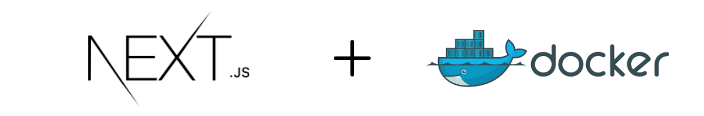
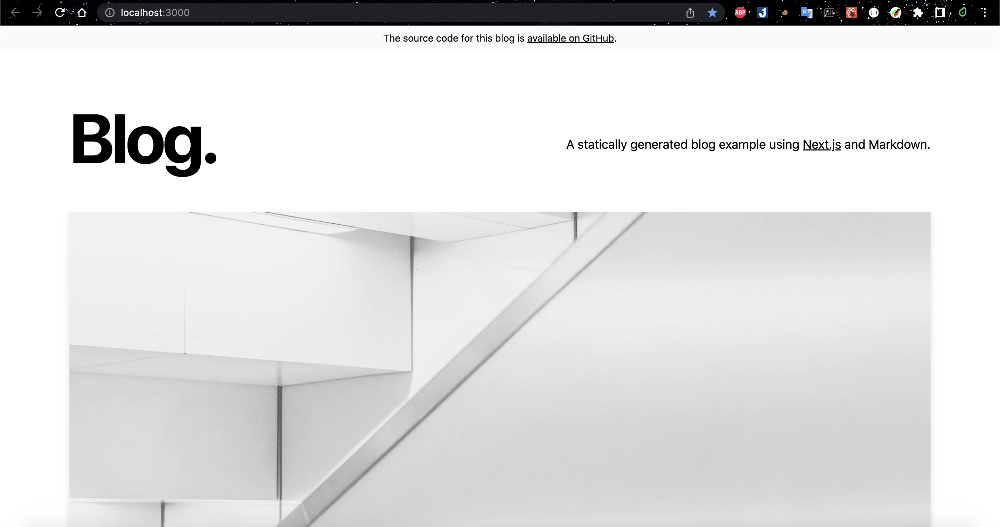
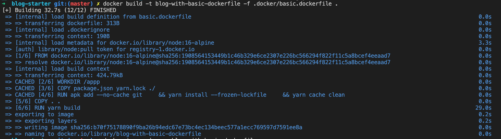
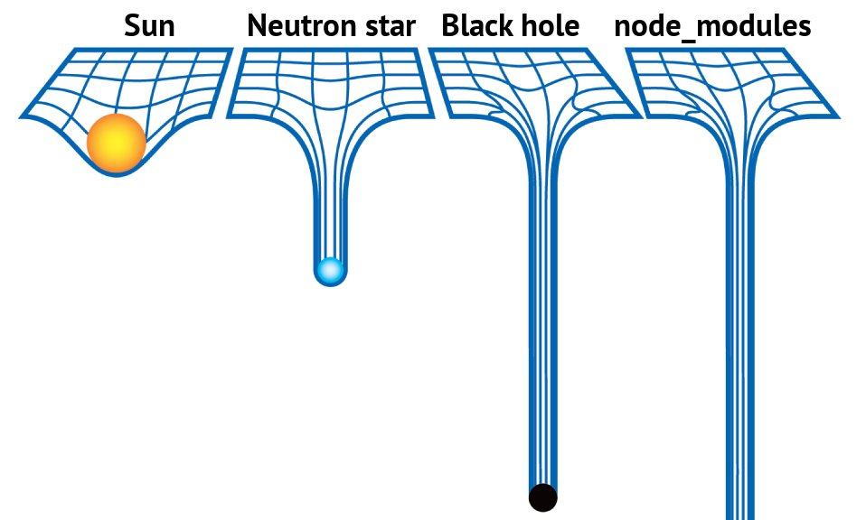
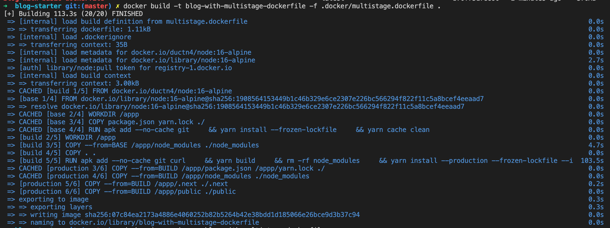
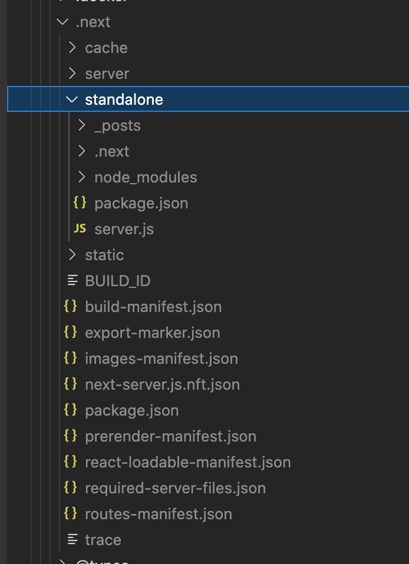
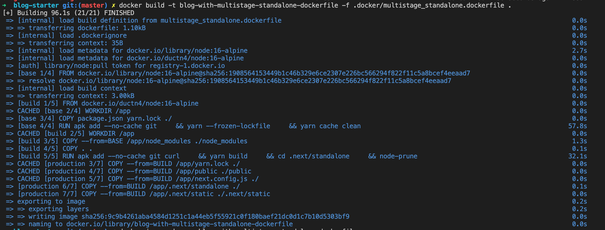

# Tối ưu Docker Image cho NextJS



Docker image của `NextJS` thông thường size sẽ **rất lớn**. Bài viết này mình sẽ
trình bày 2 cách mình hay sử dụng để tối ưu `image` trước khi triển khai lên môi
trường *production*.

Để có thể theo dõi 1 cách trực quan, mình sẽ demo theo 3 kịch bản như sau:
* Sử dụng cách cơ bản để viết `dockerfile`.
* Áp dụng `Multi Stage`.
* Sử dụng mode `standalone` của `NextJS` kết hợp với `Multi Stage`.

**Lưu ý**: Mình sẽ không tập trung nhiều về các cách cơ bản (như hạn chế tạo nhiều
Layer, .dockerignore, ...) để tối ưu image, mà sẽ trình bày sâu vào 2 cách chính
đã đề cập ở trên. Các bạn có thể theo dõi bài viết **[Tối ưu Docker image](https://viblo.asia/p/toi-uu-docker-image-Eb85o9D4Z2G)** của anh **[Mai Trung Đức](https://viblo.asia/u/maitrungduc1410)**
để tham khảo thêm các cách để tối ưu docker image rất hay và chi tiết 😄

Oke !!! Vào thôi

## Setup

Đầu tiên, chúng ta cần 1 project sử dụng `NextJS`, ở đây để cho nhanh mình sẽ sài
luôn cái **blog-starter** trong phần `examples` của `NextJS`. Các bạn có thể clone
ở [đây](https://github.com/vercel/next.js/tree/canary/examples/blog-starter) về nha 😄

Cấu trúc của nó trông như này:

```sh
.
├── @types
│   └── remark-html.d.ts
├── README.md
├── _posts
│   ├── dynamic-routing.md
│   ├── hello-world.md
│   └── preview.md
├── components
│   ├── alert.tsx
│   ├── avatar.tsx
│   ├── container.tsx
│   ├── cover-image.tsx
│   ├── date-formatter.tsx
│   ├── footer.tsx
│   ├── header.tsx
│   ├── hero-post.tsx
│   ├── intro.tsx
│   ├── layout.tsx
│   ├── markdown-styles.module.css
│   ├── meta.tsx
│   ├── more-stories.tsx
│   ├── post-body.tsx
│   ├── post-header.tsx
│   ├── post-preview.tsx
│   ├── post-title.tsx
│   └── section-separator.tsx
├── interfaces
│   ├── author.ts
│   └── post.ts
├── lib
│   ├── api.ts
│   ├── constants.ts
│   └── markdownToHtml.ts
├── next-env.d.ts
├── package.json
├── pages
│   ├── _app.tsx
│   ├── _document.tsx
│   ├── index.tsx
│   └── posts
│       └── [slug].tsx
├── postcss.config.js
├── public
│   ├── assets
│   │   └── blog
│   │       ├── authors
│   │       │   ├── jj.jpeg
│   │       │   ├── joe.jpeg
│   │       │   └── tim.jpeg
│   │       ├── dynamic-routing
│   │       │   └── cover.jpg
│   │       ├── hello-world
│   │       │   └── cover.jpg
│   │       └── preview
│   │           └── cover.jpg
│   └── favicon
│       ├── android-chrome-192x192.png
│       ├── android-chrome-512x512.png
│       ├── apple-touch-icon.png
│       ├── browserconfig.xml
│       ├── favicon-16x16.png
│       ├── favicon-32x32.png
│       ├── favicon.ico
│       ├── mstile-150x150.png
│       ├── safari-pinned-tab.svg
│       └── site.webmanifest
├── styles
│   └── index.css
├── tailwind.config.js
└── tsconfig.json
```

Okie, sau đấy cài và chạy thử lên xem phát :v

```sh
➜  blog-starter git:(master) ✗ yarn
➜  blog-starter git:(master) ✗ yarn build
➜  blog-starter git:(master) ✗ yarn start
```

Các bạn truy cập vào [localhost:3000](http://localhost:3000) để xem qua nhé :3



Trông cũng ổn đấy :v, ô kê vào phần chính nào ...

## Build on Docker

Đầu tiên thì mình sẽ nhét những `files` hay `folders` không cần thiết vào `.dockerignore`:

```.dockerignore
node_modules
.next
.vscode
*.DS_Store
.gitignore
README.md
.dockerignore
LICENSE
.docker
.gitlab
```

Như đã đề cập ở trên mình sẽ trình bày 3 kịch bản. Bây giờ, mình sẽ sử dụng cách
tạo cơ bản trước theo [basic.dockerfile](blog-starter/.docker/basic.dockerfile):

```dockerfile
FROM node:16-alpine
LABEL author="ductnn <ductn53@gmail.com>"

WORKDIR /app

COPY package.json yarn.lock ./
RUN apk add --no-cache git \
    && yarn install --frozen-lockfile \
    && yarn cache clean

COPY . .
RUN yarn build

EXPOSE 3000

CMD ["yarn", "start"]
```

Tiến hành `build`:

```sh
➜  blog-starter git:(master) ✗ docker build -t blog-with-basic-dockerfile -f .docker/basic.dockerfile .
```



```sh
# Check docker images
➜  blog-starter git:(master) ✗ docker images
REPOSITORY                                       TAG                               IMAGE ID       CREATED          SIZE
blog-with-basic-dockerfile                       latest                            b70f75178890   8 seconds ago    370MB
```

Ở cách build này, `image` tạo ra có kích thước là **370MB**. Trên thực tế, dự án
của chúng ta sẽ cần nhiều `packages` hơn nên với cách build này chúng ta không thể
tối ưu được nhiều.

Tiếp theo, mình sẽ dùng `Multi stage` để build [dockerfile](blog-starter/.docker/multistage.dockerfile).
Ở đây, mình chia thành 3 `stage` là `base`, `build`, `production`:

```dockerfile
# Build BASE
FROM node:16-alpine as BASE
LABEL author="ductnn <ductn53@gmail.com>"

WORKDIR /app
COPY package.json yarn.lock ./
RUN apk add --no-cache git \
    && yarn install --frozen-lockfile \
    && yarn cache clean

# Build Image
FROM ductn4/node:16-alpine AS BUILD
LABEL author="ductnn <ductn53@gmail.com>"

WORKDIR /app
COPY --from=BASE /app/node_modules ./node_modules
COPY . .
RUN apk add --no-cache git curl \
    && yarn build \
    && rm -rf node_modules \
    && yarn install --production --frozen-lockfile --ignore-scripts --prefer-offline \
    # Follow https://github.com/ductnn/Dockerfile/blob/master/nodejs/node/16/alpine/Dockerfile
    && node-prune

# Build production
FROM node:16-alpine AS PRODUCTION
LABEL author="ductnn <ductn53@gmail.com>"

WORKDIR /app

COPY --from=BUILD /app/package.json /app/yarn.lock ./
COPY --from=BUILD /app/node_modules ./node_modules
COPY --from=BUILD /app/.next ./.next
COPY --from=BUILD /app/public ./public

EXPOSE 3000

CMD ["yarn", "start"]
```

Ở `stage: base` mình tiền hành `install package.json`, mục đích là để lấy `node_modules`
phục vụ cho `stage: build`. Trong có trình thực hiện cài đặt mình có dùng thêm
`--frozen-lockfile` để "đóng băng" `packages`.

Tiếp theo, `stage: build` là `stage` quan trọng nhất. Bước này, mình sẽ `copy`
`node_modules` ở `stage: base` và `source code` xong tiến hành `yarn build`. Sau
khi `build` xong mình sẽ xoá `node_modules` đi và ... cài lại 😅 ủa để làm chi ???
Có 1 chút khác mình sử dụng thêm `--production` với mục đích chỉ cài các `packages`
cần thiết trong `packeage.json` và bỏ qua các `packages` trong phần `devDependencies`.
Điều này sẽ giúp giảm nhẹ hơn `node_modules` rất nhiều,



mình không cần lo chạy lỗi vì mình đã `build` đầy đủ từ bước trên rồi. Nhưng mình
vẫn muốn thằng `node_modules` nhẹ hơn ...

  <p align="center">
    
  </p>

Okies !!! Tiếp đó, mình sử dụng 1 chiếc *tool* để làm nhẹ đi `node_modules` tên
là [node-prune](https://github.com/tj/node-prune), trong `base node image` ở `stage build`
mình đã cài sẵn `node-prune`, anh em có thể tham khảo cách cài đặt tại [đây](https://github.com/ductnn/Dockerfile/blob/master/nodejs/node/16/alpine/Dockerfile).

Cuối cùng, `stage: production` mình chỉ cần `copy` các `files, folders` cần thiết
xuống là được. Build thử nào:

```sh
➜  blog-starter git:(master) ✗ docker build -t blog-with-multistage-dockerfile -f .docker/multistage.dockerfile .
```



```sh
# Check docker images
➜  blog-starter git:(master) ✗ docker images
REPOSITORY                                           TAG                               IMAGE ID       CREATED           SIZE
blog-with-multistage-dockerfile                      latest                            07c84ea2173a   38 seconds ago    339MB
```

Tác dụng của `node-prune`:

```sh
         files total 43,924
       files removed 12,814
        size removed 28 MB
            duration 866ms
```

Vậy là cũng giảm được khá khá so với cách build basic.

Cách cuối cùng, mình vẫn sẽ làm giống cách 2 là sử dụng `Multi stage` nhưng sẽ
kết hợp thêm `mode: standalone`, cách này thì mình cũng mới sử dụng do các anh
dev `maintain` thằng `NextJS` cũng đang **fix bugs** cho phần này. 

Để sử dụng `mode standalone` mình sẽ tạo thêm file `next.config.js` (nếu trong dự
án của anh em có rồi thì thôi :v) và thêm 1 đoạn code nhỏ:

```js
module.exports = {
    output: "standalone"
}
```

Sau đó, chúng ta tiến hành build thử, ở `mode` này trong `folder .next` sẽ tạo
ra thêm 1 folder con tên là `standalone`. Trong đây, `NextJS` sẽ tự động `copy`
các `files` và `packages` cần thiết để chạy, tham khảo [thêm](https://nextjs.org/docs/advanced-features/output-file-tracing)

  <p align="center">
    
  </p>

Oke, bắt đầu viết `dockerfile`:

```dockerfile
# Build BASE
FROM node:16-alpine as BASE
LABEL author="ductnn"

WORKDIR /app
COPY package.json yarn.lock ./
RUN apk add --no-cache git \
    && yarn --frozen-lockfile \
    && yarn cache clean


# Build Image
FROM ductn4/node:16-alpine AS BUILD
LABEL author="ductnn"

WORKDIR /app
COPY --from=BASE /app/node_modules ./node_modules
COPY . .
RUN apk add --no-cache git curl \
    && yarn build \
    && cd .next/standalone \
    # Follow https://github.com/ductnn/Dockerfile/blob/master/nodejs/node/16/alpine/Dockerfile
    && node-prune


# Build production
FROM node:16-alpine AS PRODUCTION
LABEL author="ductnn"

WORKDIR /app

COPY --from=BUILD /app/yarn.lock ./
COPY --from=BUILD /app/public ./public
COPY --from=BUILD /app/next.config.js ./

# Set mode "standalone" in file "next.config.js"
COPY --from=BUILD /app/.next/standalone ./
COPY --from=BUILD /app/.next/static ./.next/static

EXPOSE 3000

CMD ["node", "server.js"]
```

Vẫn giống cách làm của cách 2, chỉ khác ở `stage: production` ta chỉ cần copy
folders `.next/standalone` và `.next/static` thay vì copy hết cả folders `.next`
và `node_modules`. Oke build thôi ....

```sh
➜  blog-starter git:(master) ✗ docker build -t blog-with-multistage-standalone-dockerfile -f .docker/multistage_standalone.dockerfile .
```



```sh
# Check docker images
➜  blog-starter git:(master) ✗ docker images
REPOSITORY                                                      TAG                     IMAGE ID       CREATED           SIZE
blog-with-multistage-standalone-dockerfile                      latest                  07c84ea2173a   38 seconds ago    119MB
```

**WoW** `image` build ra chỉ con **119MB** nhẹ đáng kể :v


## Kết
Vậy là mình vừa trình bày 2 cách để tối ưu image cho dự án sử dụng `NextJS`. Anh
em cho mình xin ý kiến và nếu có thêm phương pháp tối ưu nào khác thì **share**
cho mình với nhé  🥳 🥳 🥳.

Cảm ơn anh em !!!
